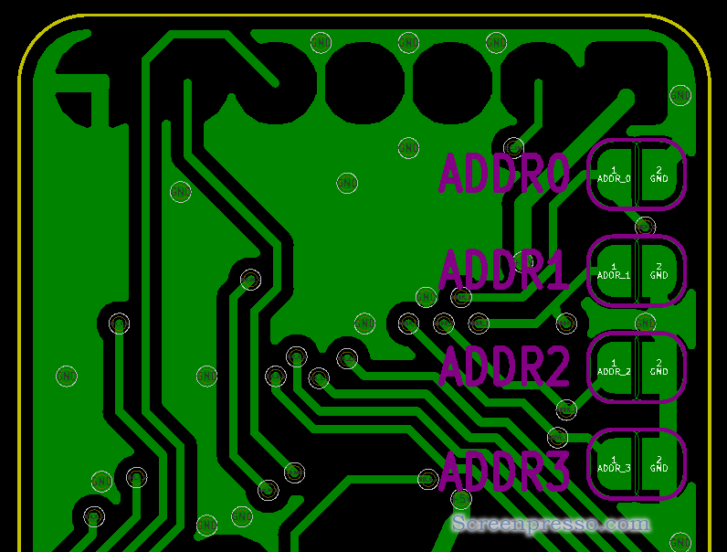

# Getting Started with nix modules

## 必要なもの

### ニキシー管

ニキシー管 - Wikipedia

https://ja.wikipedia.org/wiki/%E3%83%8B%E3%82%AD%E3%82%B7%E3%83%BC%E7%AE%A1

ニキシー管は生産国や年代によって多くの種類がありますが、そのほぼ全てが数十年前に生産終了となっています。現在流通しているのはデッドストック品や中古品です。
nix moduleは**IN-12**および**IN-14**と呼ばれるニキシー管に対応しています。これらは現在でも比較的手に入りやすく、価格も手頃なニキシー管です。

IN-14はサイドビュー型(管の横から数字を表示)、IN-12はトップビュー型(管の上面から表示)の形状です。IN-12にはIN-12A/IN-12Bという種類があり、ドットの有無が異なります。
また、IN-15A/Bのように数字ではなく記号を表示するニキシー管もあります。こちらはIN-12とピン互換のため、IN-12版nix moduleで点灯可能です(Arduinoライブラリは未対応)。

### 高圧電源
ニキシー管を点灯させるには150 - 200Vの直流電源が必要です。多くの場合は昇圧モジュールを使いACアダプタや電池などの低圧電源を昇圧して供給します。高圧電源キットの他、MC34062を使ったDC-DCコンバータなどの作例も多くあります。

[参考]

ニキシー管 電源 - Google検索

https://www.google.com/search?q=%E3%83%8B%E3%82%AD%E3%82%B7%E3%83%BC%E7%AE%A1+%E9%9B%BB%E6%BA%90


ニキシー管用小型高圧電源キット

https://www.kadenken.com/shopdetail/000000000727/

昇圧して高電圧(DC140V~)を作る

https://qiita.com/hotchpotch/items/b9ec56266a5592cc3317


## ニキシー管のハンダ付け
moduleにニキシー管をハンダ付けします。ニキシー管の裏側に1番ピンを示す矢印があります。moduleの1番ピンに合うように差し込んで下さい。また、IN-12はソケットピンを使用するとニキシー管の交換が楽になります。

ソケットピンは最初にニキシー管の足にピンを挿してからmoduleに取り付けて下さい。

## Arduinoライブラリ
[Library Reference](library_reference.md)参照

## 配線
ArduinoのI2C PinおよびLED制御用のDigital pinに接続します。
電源は5VとGNDをArduinoに接続、module上部のピンに高圧電源の出力とそのGNDを接続します。


## テスト
Arduinoにサンプルコードを書き込み、点灯をチェックします。

## nix moduleのI2Cアドレス設定
複数のnix moduleを1つのI2Cバスで連結させる場合、モジュール裏側のジャンパをショートさせることでそれぞれ重複しないI2Cアドレスを設定する必要があります
(オープン = '1'　ショート = '0')。



nix moduleのアドレスはデフォルト(ジャンパのショート無し)で0x4Fです。アドレス下位4bitをジャンパで設定します。

module 0: アドレス = 0x4F (1111, ジャンパショート無し)

module 1: アドレス = 0x4E (1110, ADDR0をショート)

module 2: アドレス = 0x4D (1101, ADDR1をショート)

module 3: アドレス = 0x4C (1100, ADDR1, ADDR0をショート)

etc...

ここで設定したアドレスをArduinoのコードに書き込みます。

```
#include "NixieModule_IN_12.h"

#include <Wire.h>
#define ADDR0 0x4F
#define ADDR1 0x4E
#define ADDR2 0x4D
#define ADDR3 0x4C

NixieModule_IN_12 nix3 = NixieModule_IN_12(ADDR0);
NixieModule_IN_12 nix2 = NixieModule_IN_12(ADDR1);
NixieModule_IN_12 nix1 = NixieModule_IN_12(ADDR2);
NixieModule_IN_12 nix0 = NixieModule_IN_12(ADDR3);

void setup() { 

  nix0.init();
  nix1.init();
  nix2.init();
  nix3.init();
    .
    .
    .
}

    .
    .
    .

```

