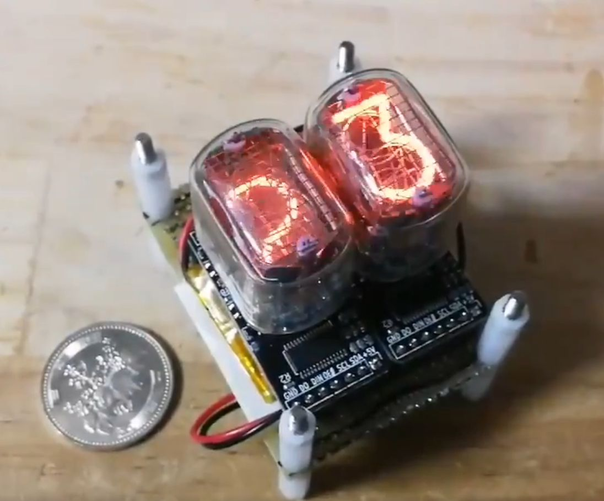
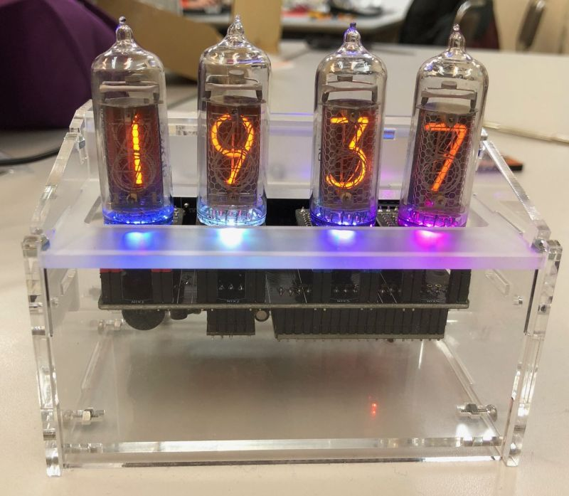

# nix module: miniature nixie tube driver modules

## nix module(仮)
nix moduleはニキシー管の制御に必要な部品を2x4cmの小さな基板に詰め込んだモジュールです。高圧電源の制御や煩雑なダイナミック点灯のコードを考える必要もなく、マイコンとI2Cで接続するだけでニキシー管の制御が可能です。Arduinoライブラリと組み合わせることでシンプルにニキシー管を点灯させることができます。

最大16桁をI2C経由で連結させ、各桁を独立して制御できます。すべての数字でフェードイン・フェードアウト、シャッフルなどのエフェクトが可能です。またRGB LEDによるバックライトもついています。

## Features
- 2x4cm
- I2Cインタフェース(プルアップ抵抗実装済み)
- ハードウェアPWM制御
- RGBバックライト(WS2812B互換 SK6812mini)
- スタティック点灯でシンプルな回路構成

## Arduino Library
ライブラリは[こちら](https://github.com/minori24/Lib_Nixie_Module)にあります。

使用方法は [Getting Started](doc/getting_started.md) および [Library Reference](doc/library_reference.md) を参照して下さい。

## Open Design
回路図、BOM、PCB DesignをこのGitHub Repoで公開しています。KiCadで自由に編集可能です。

回路図(IN-12 module): [Nixie_Module_IN-12_Schematics.pdf](doc/Nixie_Module_IN-12_Schematics.pdf)

PWMドライバはサーボモータの制御によく使われるPCA9685PW、RGB LEDはシリアル接続LEDの小型版なので、Arduino以外のマイコンボードやRaspberry Piによる制御も簡単に行えます。

## Issue
動作に不明点、問題などある場合はぜひ[Issue](https://github.com/minori24/NixieModule/issues)を立てて下さい。

## Project Examples

Nixie Watch (by [@Robo_akira](https://twitter.com/Robo_akira/status/1117429584108982274))

IN-14 Nixie Clock

